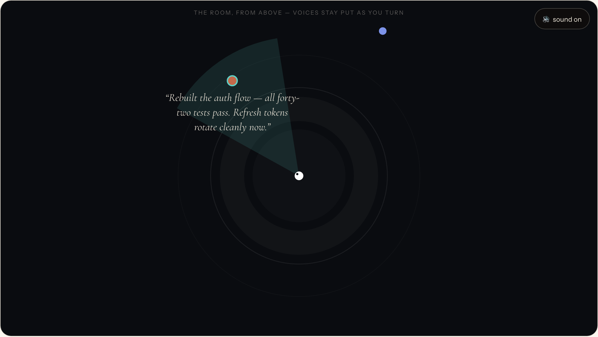

<p align="center">
  
</p>

<p align="center">
  <a href="https://antiphon.dev">antiphon.dev</a> ·
  <a href="https://antiphon.dev/demo.html">web demo</a> ·
  <a href="https://antiphon.dev/docs/">docs</a> ·
  <a href="https://antiphon.dev/docs/blog/about-antiphon/">why this exists</a>
</p>

---

**Antiphon is a spatial-audio monitor for coding agents.** Every agent session gets a voice
and a seat in a virtual room around you: real binaural rendering (measured HRTFs, room
acoustics), head-tracked by your webcam, gentle by design. Tool calls tick each agent's
chord. Long tasks settle into a low machine hum. When an agent finishes, it *tells you* —
a spoken sentence or two, from exactly where its work is.

And the part everything is built around: **close your eyes.** The camera notices, the desk
falls away, and the room comes up. Turn toward a voice, linger, and it delivers its report.
Open your eyes and a reply box is waiting.

<p align="center">
  
</p>

## Install

macOS 14+ on Apple Silicon:

1. **[Download Antiphon](https://github.com/cfoust/antiphon/releases/latest)**
   (`Antiphon-<version>-macOS.zip`), unzip, drag to `/Applications`, launch.
   Releases are signed and notarized.
2. Connect your agent — e.g. for Claude Code:
   ```bash
   claude plugin marketplace add cfoust/antiphon
   claude plugin install antiphon@antiphon
   ```
   [Codex, OpenCode, Pi, and Aider](https://antiphon.dev/docs/agents/) adapters live in
   [`plugins/`](plugins/).

Wear headphones. That's the whole trick.

Voices default to the built-in macOS ones; add an ElevenLabs or OpenAI key in
**Settings → Voices** for much better ones. Full instructions in the
[docs](https://antiphon.dev/docs/install/).

## Try it without installing

The **[web demo](https://antiphon.dev/demo.html)** runs the identical engine compiled to
WebAssembly — same HRTFs, same room, head tracking through your browser — with scripted
agents instead of yours.

## Under the hood

One Rust DSP core (`crates/antiphon-dsp`), one C ABI, two hosts — the native app and the
wasm demo are verified byte-identical (parity ≈ −155 dBFS, enforced in CI). Signal path:
minimum-phase HRIR convolution + fractional-delay ITD → image-source early reflections →
FDN or BRIR-convolution late reverb, all at 48 kHz in 128-frame blocks. A small Go daemon
(`antiphond`, bundled in the app) registers agent sessions, assigns personas, and runs the
TTS ladder. Details in [the engine docs](https://antiphon.dev/docs/engine/).

```bash
git clone https://github.com/cfoust/antiphon && cd antiphon
just bake   # bake the HRTF + room asset
just app    # build Antiphon.app (Rust staticlib + swiftc; no Xcode project)
just serve  # or: run the site + web demo locally
```

HRTF data: [MIT KEMAR](https://sound.media.mit.edu/resources/KEMAR.html) (Gardner &
Martin, MIT Media Lab).

## License

[MIT](LICENSE) © 2026 Caleb Foust
